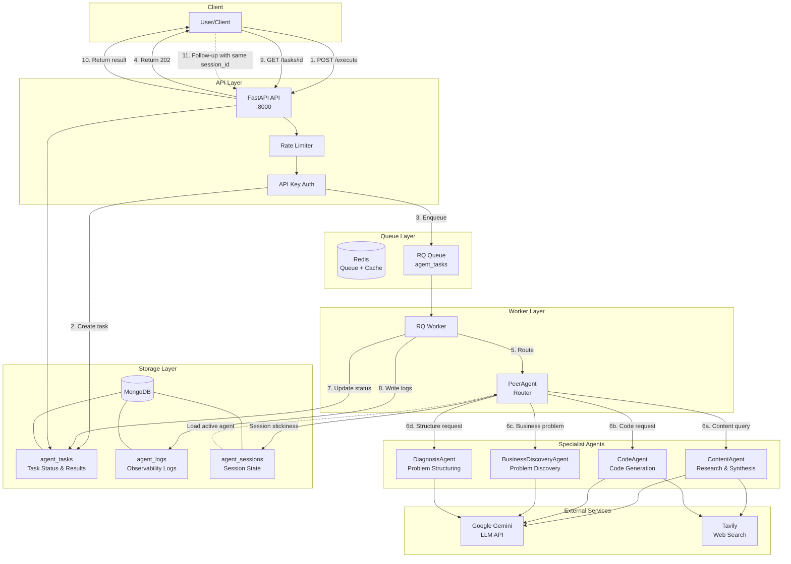
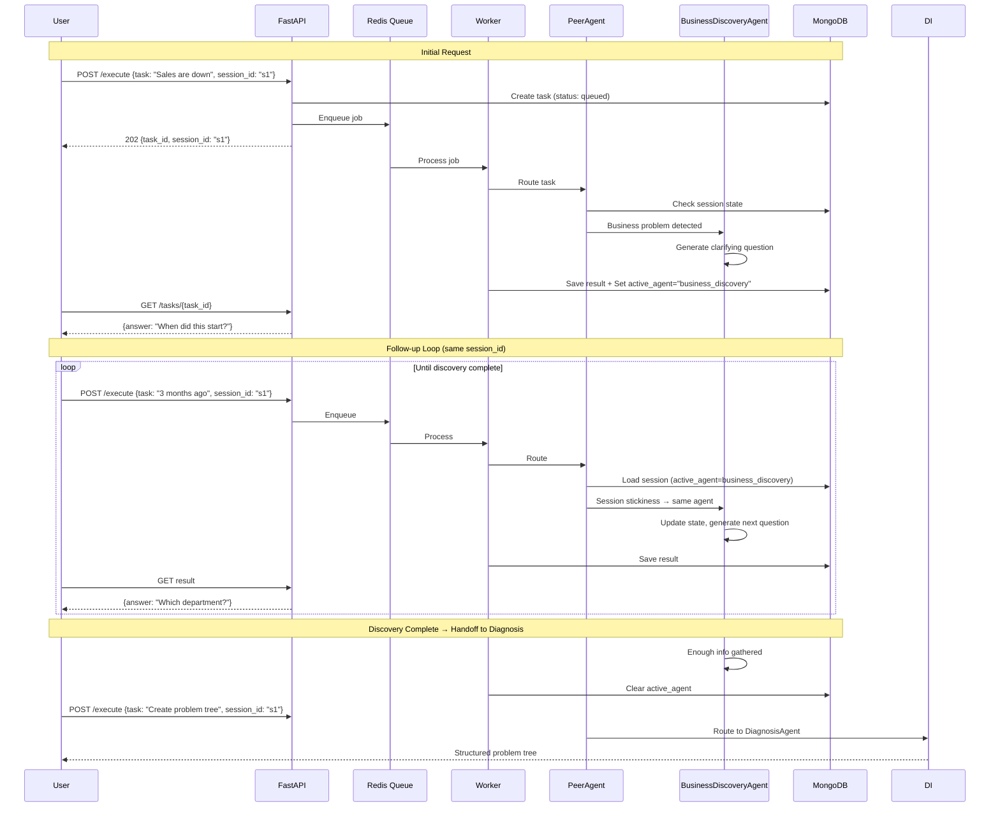

# agent_p

An agentic API system featuring intelligent routing, multi-agent orchestration, and async task processing with queue-based worker architecture.

---

## Table of Contents

1. [Quick Start (Docker Compose)](#quick-start-docker-compose)
2. [Architecture](#architecture)
3. [API Reference](#api-reference)
4. [API Versioning Strategy](#api-versioning-strategy)
5. [Rate Limiting](#rate-limiting)
6. [Authentication](#authentication)
7. [Queue & Worker System](#queue--worker-system)
8. [Local Development](#local-development)
9. [Testing](#testing)
10. [Deployment (AWS CodeDeploy)](#deployment-aws-codedeploy)
11. [AI Tools Integration](#ai-tools-integration)
12. [Logging Architecture](#logging-architecture)
13. [LLM Selection & Prompt Engineering](#llm-selection--prompt-engineering)
14. [Current Status & Production Readiness](#current-status--production-readiness)
15. [Troubleshooting](#troubleshooting)
16. [References](#references)

---

## Quick Start (Docker Compose)

### 1. Configure Environment

```bash
# Copy and edit environment file
cp env.example .env

# Required: Add your API keys
# Edit .env and set:
#   GOOGLE_API_KEY=your-gemini-api-key
#   TAVILY_API_KEY=your-tavily-api-key
```

### 2. Start Services

```bash
docker-compose up --build
```

This starts:
- **API**: FastAPI on `http://localhost:8000`
- **Worker**: RQ worker consuming the `agent_tasks` queue
- **MongoDB**: Document store for tasks, sessions, and logs
- **Redis**: Queue backend and rate limiting store

### 3. Verify Installation

```bash
# Check health
curl http://localhost:8000/health

# Expected: {"status": "healthy", "mongo": {"ok": true}, "redis": {"ok": true}}
```

### 4. Try Your First Request

```bash
# Submit a task
curl -X POST http://localhost:8000/v1/agent/execute \
  -H "Content-Type: application/json" \
  -d '{"task": "Python ile basit bir web scraper nasıl yazılır?"}'

# Response: {"task_id": "abc-123", "status": "queued", "session_id": "abc-123"}

# Get result (wait a few seconds for processing)
curl http://localhost:8000/v1/agent/tasks/abc-123
```

### Quick Reference

| Service | URL | Purpose |
|---------|-----|---------|
| API | http://localhost:8000 | Main endpoint |
| Swagger Docs | http://localhost:8000/docs | Interactive API docs |
| ReDoc | http://localhost:8000/redoc | Alternative docs |
| Health Check | http://localhost:8000/health | System status |

---

## Architecture

### System Overview Diagram



### Conversation Loop (Multi-Turn Flow)



### Data Flow Summary

```
┌──────────────────────────────────────────────────────────────────────────────┐
│                              REQUEST FLOW                                     │
├──────────────────────────────────────────────────────────────────────────────┤
│  Client ──► API ──► Redis Queue ──► Worker ──► PeerAgent ──► Agent ──► LLM  │
│                                                                               │
│  1. POST /execute     3. Enqueue job    5. Route task    7. Process          │
│  2. Create task       4. Return 202     6. Select agent  8. Call Gemini/Tavily│
└──────────────────────────────────────────────────────────────────────────────┘

┌──────────────────────────────────────────────────────────────────────────────┐
│                              LOGGING FLOW                                     │
├──────────────────────────────────────────────────────────────────────────────┤
│  Worker ──► MongoDB (agent_logs)                                             │
│                                                                               │
│  Each agent interaction logs:                                                 │
│  • task_id, session_id (correlation)                                         │
│  • agent name, stage                                                          │
│  • prompt sent to LLM                                                         │
│  • raw + parsed output                                                        │
│  • latency_ms                                                                 │
└──────────────────────────────────────────────────────────────────────────────┘
```

### Component Overview

| Component | Purpose |
|-----------|---------|
| **FastAPI API** | HTTP endpoints, request validation, queue integration |
| **RQ Worker** | Async task processor, agent orchestration |
| **PeerAgent** | LLM-based intent router with session stickiness |
| **ContentAgent** | Web research + answer synthesis with citations |
| **CodeAgent** | Research-first code generation |
| **BusinessDiscoveryAgent** | Socratic interview for problem discovery |
| **DiagnosisAgent** | Problem tree structuring |
| **MongoDB** | Task persistence, session state, agent logs |
| **Redis** | Job queue, rate limiting token bucket |

### Agent Capabilities

| Agent | Trigger Keywords | Capabilities | Output Format |
|-------|-----------------|--------------|---------------|
| **ContentAgent** | "bilgi", "açıkla", "nedir", "what is", "explain" | Web araştırma, kaynak sentezi, alıntılama | Markdown + References |
| **CodeAgent** | "kod", "code", "yaz", "write", "script", "function" | Kod üretimi, web search ile güncel docs, güvenlik kontrolü | Code block + Explanation |
| **BusinessDiscoveryAgent** | "satış", "problem", "sorun", "düşüyor", "declining" | Sokratik soru sorma, kök neden keşfi, iteratif görüşme | Clarifying questions |
| **DiagnosisAgent** | "ağaç", "tree", "structure", "MECE", "organize" | Problem yapılandırma, MECE analizi, issue tree | Structured JSON + Markdown |

### Routing Logic

```
User Input → PeerAgent
                │
                ├── Session has active_agent? 
                │   └── Yes → Route to active agent (stickiness)
                │
                ├── LLM classification available?
                │   └── Yes → Use LLM routing (confidence-based)
                │
                └── Fallback → Keyword matching
                    └── No match → Default to ContentAgent
```

---

## API Reference

### Endpoints

#### `POST /v1/agent/execute`

Create and enqueue an agent task.

**Request:**
```json
{
  "task": "Explain how Python generators work",
  "session_id": "optional-session-id"
}
```

**Response (202 Accepted):**
```json
{
  "task_id": "uuid",
  "status": "queued",
  "session_id": "uuid-or-provided"
}
```

**Errors:**
| Status | Reason |
|--------|--------|
| 400 | Empty task content |
| 401 | Invalid or missing API key (when configured) |
| 429 | Rate limit exceeded |

---

#### `GET /v1/agent/tasks/{task_id}`

Retrieve task status and result.

**Response (200 OK):**
```json
{
  "task_id": "uuid",
  "status": "completed",
  "result": {
    "answer": "...",
    "sources": [...],
    "model": "gemini-3-flash-preview",
    "error": null
  },
  "route": "content",
  "route_confidence": 0.95,
  "route_rationale": "...",
  "session_id": "uuid"
}
```

**Status Values:** `queued` | `processing` | `completed` | `failed`

---

### Usage Examples

#### Example 1: Content Research (ContentAgent)

```bash
# Ask a research question
curl -X POST http://localhost:8000/v1/agent/execute \
  -H "Content-Type: application/json" \
  -d '{"task": "Kimi K2 modeli hakkında beni bilgilendir"}'

# Response includes web-sourced answer with citations
```

#### Example 2: Code Generation (CodeAgent)

```bash
# Request code
curl -X POST http://localhost:8000/v1/agent/execute \
  -H "Content-Type: application/json" \
  -d '{"task": "Python ile dosya okuma ve yazma örneği göster"}'

# Response includes working code with explanations
```

#### Example 3: Business Problem Discovery (Multi-Turn)

```bash
# Start discovery session
curl -X POST http://localhost:8000/v1/agent/execute \
  -H "Content-Type: application/json" \
  -d '{"task": "Satışlarımız düşüyor, problemi anlamama yardım et", "session_id": "discovery-001"}'

# Agent asks clarifying question: "Bu düşüş ne zamandan beri devam ediyor?"

# Continue with same session_id
curl -X POST http://localhost:8000/v1/agent/execute \
  -H "Content-Type: application/json" \
  -d '{"task": "3 aydır devam ediyor", "session_id": "discovery-001"}'

# Agent asks next question, building understanding iteratively
```

#### Example 4: Problem Structuring (DiagnosisAgent)

```bash
# Create problem tree
curl -X POST http://localhost:8000/v1/agent/execute \
  -H "Content-Type: application/json" \
  -d '{"task": "Problem ağacı oluştur: Pazarlama verimsiz, rakipler ucuz, ürün farklılaşması yok"}'

# Response includes structured MECE problem tree
```

---

#### `GET /health`

System health check.

**Response:**
```json
{
  "status": "healthy",
  "mongo": { "ok": true, "error": null },
  "redis": { "ok": true, "error": null }
}
```

Returns `503` if any service is degraded.

---

## API Versioning Strategy

### Current: URL Path Versioning (`/v1/`)

All endpoints use URL path versioning (e.g., `/v1/agent/execute`).

**Benefits:**
- Clear and explicit version in every request
- Easy to route at load balancer level
- Simple to maintain multiple versions concurrently
- Visible in logs and monitoring

### Recommended Future Strategy

| Version | Approach | When to Use |
|---------|----------|-------------|
| **URL Path** (`/v1/`, `/v2/`) | Major breaking changes | Agent contract changes, new response formats |
| **Query Param** (`?api_version=2024-12`) | Minor variations | Feature flags, beta features |
| **Header** (`X-API-Version: 2`) | Content negotiation | When URL should be stable |

### Deprecation Policy (Recommended)

1. **Announce** deprecation 3+ months before removal
2. **Add** `Deprecation` header to responses: `Deprecation: true`
3. **Add** `Sunset` header with removal date: `Sunset: 2025-06-01`
4. **Log** usage of deprecated endpoints for migration tracking
5. **Maintain** at most 2 active versions (current + previous)

---

## Rate Limiting

### Token Bucket Algorithm

The API uses a Redis-backed token bucket rate limiter with the following defaults:

| Parameter | Default | Environment Variable |
|-----------|---------|---------------------|
| Requests per minute | 60 | `RATE_LIMIT_REQUESTS_PER_MIN` |
| Burst capacity | 10 | `RATE_LIMIT_BURST` |
| Enable/Disable | false | `RATE_LIMIT_ENABLED` |

### Response Headers

When rate limiting is enabled:

```http
X-RateLimit-Limit: 60
X-RateLimit-Remaining: 45
Retry-After: 5  # Only on 429 responses
```

### Client Identification

Rate limits are applied per client, identified by (in order of priority):
1. **API Key** (`X-API-Key` header) → `key:{api_key}`
2. **Forwarded IP** (`X-Forwarded-For`) → `ip:{first_ip}`
3. **Direct IP** → `ip:{client_host}`

### Recommendations for Production

```env
# Enable rate limiting
RATE_LIMIT_ENABLED=true

# Adjust based on capacity
RATE_LIMIT_REQUESTS_PER_MIN=100
RATE_LIMIT_BURST=20

# For high-traffic APIs, consider:
# - Per-endpoint limits (not yet implemented)
# - Tiered limits by API key/subscription
# - Separate limits for read vs write operations
```

### Handling 429 Responses

```python
import time
import requests

def execute_with_retry(task: str, max_retries: int = 3):
    for attempt in range(max_retries):
        response = requests.post(
            "http://localhost:8000/v1/agent/execute",
            json={"task": task}
        )
        if response.status_code == 429:
            retry_after = int(response.headers.get("Retry-After", 5))
            time.sleep(retry_after)
            continue
        return response
    raise Exception("Rate limit exceeded after retries")
```

---

## Authentication

### API Key (Optional)

Enable API key authentication by setting:

```env
API_KEY=your-secret-key
API_KEY_HEADER=X-API-Key  # Default header name
```

**Request with API Key:**
```bash
curl -X POST http://localhost:8000/v1/agent/execute \
  -H "Content-Type: application/json" \
  -H "X-API-Key: your-secret-key" \
  -d '{"task": "Hello"}'
```

**Unauthenticated endpoints:** `/health`, `/docs`, `/openapi.json`, `/redoc`

---

## Queue & Worker System

### Architecture

```
┌─────────────┐     ┌─────────────┐     ┌─────────────┐
│   FastAPI   │────▶│    Redis    │────▶│   Worker    │
│  (Producer) │     │   (Queue)   │     │ (Consumer)  │
└─────────────┘     └─────────────┘     └─────────────┘
                           │                    │
                           ▼                    ▼
                    ┌─────────────┐     ┌─────────────┐
                    │   MongoDB   │◀────│   Agents    │
                    │  (Storage)  │     │             │
                    └─────────────┘     └─────────────┘
```

### Why Queue-Based Processing?

1. **Decoupling**: API responds immediately (202), worker processes asynchronously
2. **Resilience**: Tasks survive API restarts; failed tasks can be retried
3. **Scalability**: Add more workers to handle load spikes
4. **Observability**: Queue depth indicates backlog; task status trackable in MongoDB

### Task Flow

1. Client sends `POST /v1/agent/execute`
2. API creates task in MongoDB (`status: queued`)
3. API enqueues job to Redis (`agent_tasks` queue)
4. API returns `202 Accepted` with `task_id`
5. Worker picks up job, updates status to `processing`
6. PeerAgent routes to specialist agent
7. Agent executes, result stored in MongoDB
8. Client polls `GET /v1/agent/tasks/{task_id}` for result

### Scaling Workers

```bash
# Scale to 3 workers
docker-compose up --scale worker=3
```

Workers are stateless and can be scaled horizontally.

---

## Local Development

### Prerequisites

- Python 3.12+
- Docker & Docker Compose (for services)
- MongoDB 7.0+ (or use Docker)
- Redis 7.2+ (or use Docker)

### Setup

```bash
# Create and activate virtual environment
python -m venv .venv

# Windows (PowerShell)
.\.venv\Scripts\Activate.ps1

# macOS/Linux
source .venv/bin/activate

# Install dependencies
pip install --upgrade pip
pip install -r requirements.txt
```

### Run Services (Docker)

```bash
# Start MongoDB and Redis only
docker-compose up -d mongo redis

# Run API locally
uvicorn src.api.main:app --reload --port 8000

# Run worker locally (in another terminal)
rq worker agent_tasks --url redis://localhost:6379
```

---

## Testing

### Running Tests

```bash
# Run all tests
python -m pytest -q

# Run with coverage
python -m pytest --cov=src --cov-report=term-missing

# Run specific test file
python -m pytest tests/test_api.py -v

# Run specific test
python -m pytest tests/test_api.py::test_execute_happy_path_returns_202 -v
```

### Test Structure

```
tests/
├── test_api.py                    # API endpoint tests (14 tests)
│   └── Health, execute, error handling, rate limiting, auth
├── test_peer_agent.py             # Routing logic tests (18 tests)
│   └── Keyword routing, LLM fallback, session stickiness, registry
├── test_content_agent.py          # ContentAgent tests (7 tests)
│   └── Formatting, retry logic, context resolution, trace recording
├── test_code_agent.py             # CodeAgent tests (15 tests)
│   └── Code generation, web search, conversation history
├── test_code_agent_safety.py      # Safety guardrail tests (8 tests)
│   └── Destructive request blocking, safe alternatives
├── test_business_discovery_agent.py # BusinessDiscoveryAgent tests (1 test)
│   └── Session state resumption
├── test_diagnosis_agent.py        # DiagnosisAgent tests (1 test)
│   └── Transcript-based diagnosis
└── test_worker.py                 # Worker integration tests (7 tests)
    └── Happy path routing, error handling, observability
```

**Total: 71 tests** - All using mocks (no real LLM calls required)

### Test Categories

| Category | Purpose | Examples |
|----------|---------|----------|
| **Unit** | Test individual functions/methods | Prompt formatting, response parsing |
| **Integration** | Test component interactions | Agent → MongoDB, API → Queue |
| **Happy Path** | Verify expected behavior | Valid task → 202, routing → correct agent |
| **Error Handling** | Verify error scenarios | Empty task → 400, missing task → 404 |

### Increasing Test Coverage

**Recommended areas to expand:**

1. **Edge Cases**
   - Very long tasks (token limits)
   - Unicode/special characters in tasks
   - Concurrent session access

2. **Agent-Specific Tests**
   - Mock LLM responses for deterministic testing
   - Test each agent's prompt formatting
   - Test error handling for API failures (Tavily, Gemini)

3. **Integration Tests**
   - Full flow: POST → Queue → Worker → GET result
   - Session continuity across multiple requests
   - Rate limiting behavior under load

4. **Load/Performance Tests**
   - Concurrent request handling
   - Queue backlog scenarios
   - Worker scaling behavior

```python
# Example: Adding a new integration test
@pytest.mark.asyncio
async def test_full_task_lifecycle(mongo_client, redis_client):
    """Test complete flow from POST to result retrieval."""
    # 1. POST task
    response = await client.post("/v1/agent/execute", json={"task": "test"})
    task_id = response.json()["task_id"]
    
    # 2. Process queue (simulate worker)
    # ...
    
    # 3. GET result
    result = await client.get(f"/v1/agent/tasks/{task_id}")
    assert result.json()["status"] == "completed"
```

---

## Deployment (AWS CodeDeploy)

### Prerequisites

1. **AWS Resources:**
   - EC2 instance with Docker installed
   - CodeDeploy agent installed on EC2
   - S3 bucket for deployment artifacts
   - IAM roles for CodeDeploy and EC2

2. **GitHub Secrets:**
   ```
   AWS_ACCESS_KEY_ID
   AWS_SECRET_ACCESS_KEY
   AWS_REGION
   S3_DEPLOY_BUCKET
   ```

### CI/CD Pipelines

| Workflow | Trigger | Actions |
|----------|---------|---------|
| `ci.yml` | Push, PR | Lint, Test |
| `cd.yml` | Push to `main`, Manual | Test → Build → Deploy |

### Deploy Scripts

```
deploy/scripts/
├── before_install.sh   # Prepare environment
├── start_application.sh # docker-compose up
└── stop_application.sh  # docker-compose down
```

### Manual Deployment

```bash
# Via GitHub Actions (recommended)
# Go to Actions → CD → Run workflow → Select environment

# Direct deploy (for debugging)
ssh ec2-user@your-instance
cd /opt/agent_p
docker-compose up -d --build
```

### AppSpec Configuration

See `appspec.yml` for CodeDeploy hooks configuration.

---

## AI Tools Integration

### LLM Provider: Google Gemini

All agents use **Google Gemini** (`gemini-3-flash-preview`) via **LangChain** (`langchain-google-genai`).

| Agent | Model | Purpose | Integration |
|-------|-------|---------|-------------|
| PeerAgent | gemini-3-flash-preview | Intent routing | `with_structured_output()` for schema validation |
| ContentAgent | gemini-3-flash-preview | Answer synthesis | Direct chat completion |
| CodeAgent | gemini-3-flash-preview | Code generation | Direct chat completion |
| BusinessDiscoveryAgent | gemini-3-flash-preview | Discovery dialogue | LangGraph state machine |
| DiagnosisAgent | gemini-3-flash-preview | Problem structuring | `with_structured_output()` |

**Why Gemini?**
- Fast inference (flash variant optimized for speed)
- Good multilingual support (Turkish + English)
- Competitive pricing for high-volume usage
- Native integration with LangChain ecosystem

### Web Search: Tavily API

**ContentAgent** and **CodeAgent** use [Tavily](https://tavily.com/) for real-time web search:
- Retrieves current documentation and articles
- Provides relevance scores for result ranking
- Enables citation-backed answers

```python
# Example: Tavily search integration
results = await tavily.search(
    query="Python asyncio best practices 2024",
    search_depth="advanced",
    max_results=5
)
```

### Configuration

```env
# === Required ===
GOOGLE_API_KEY=your-gemini-api-key      # Get from: https://aistudio.google.com/
TAVILY_API_KEY=your-tavily-api-key      # Get from: https://tavily.com/

# === Optional (with defaults) ===
GEMINI_MODEL=gemini-3-flash-preview     # LLM model to use
MONGODB_URL=mongodb://mongo:27017       # MongoDB connection
REDIS_URL=redis://redis:6379            # Redis connection

# === Security (Optional) ===
API_KEY=                                # Set to enable API key auth
API_KEY_HEADER=X-API-Key                # Header name for API key

# === Rate Limiting (Optional) ===
RATE_LIMIT_ENABLED=false                # Enable/disable rate limiting
RATE_LIMIT_REQUESTS_PER_MIN=60          # Requests per minute
RATE_LIMIT_BURST=10                     # Burst capacity

# === Session Management ===
SESSION_TTL_MINUTES=30                  # Session stickiness duration
```

> **Note:** See `env.example` for the complete configuration template.

### Switching LLM Providers

The system uses LangChain's abstraction layer, making it easy to switch providers:

```python
# Current: Gemini
from langchain_google_genai import ChatGoogleGenerativeAI
llm = ChatGoogleGenerativeAI(model="gemini-3-flash-preview")

# Alternative: OpenAI
from langchain_openai import ChatOpenAI
llm = ChatOpenAI(model="gpt-4o-mini")

# Alternative: Anthropic
from langchain_anthropic import ChatAnthropic
llm = ChatAnthropic(model="claude-3-5-sonnet-20241022")
```

---

## Logging Architecture

### Why MongoDB for Logging?

We chose **MongoDB** over alternatives (Elasticsearch, CloudWatch, file-based) for the following reasons:

| Criteria | MongoDB | Elasticsearch | File-based |
|----------|---------|---------------|------------|
| **Schema flexibility** | ✅ Native JSON | ✅ Good | ❌ Limited |
| **Operational simplicity** | ✅ Already in stack | ❌ Separate cluster | ✅ Simple |
| **Query capabilities** | ✅ Rich queries | ✅ Excellent | ❌ grep only |
| **Correlation with tasks** | ✅ Same DB | ⚠️ Cross-service | ❌ Manual |
| **Cost** | ✅ Included | ❌ Additional infra | ✅ Free |

**Key Decision Factors:**
1. **Single datastore** - Tasks and logs in same MongoDB reduces operational complexity
2. **Natural correlation** - Logs reference `task_id` and `session_id` for easy tracing
3. **Flexible schema** - Different agents can log different fields without migrations
4. **Query-friendly** - Easy to filter by agent, session, time range

### Log Structure

```json
{
  "task_id": "uuid",
  "session_id": "uuid",
  "agent": "content_agent",
  "stage": "synthesis",
  "model": "gemini-3-flash-preview",
  "prompt": "...",
  "raw_output": "...",
  "parsed_output": {...},
  "latency_ms": 1234.5,
  "created_at": "2024-12-18T10:00:00Z"
}
```

### Log Collections

| Collection | Purpose | Retention |
|------------|---------|-----------|
| `agent_tasks` | Task status, results, routing metadata | Long-term |
| `agent_logs` | Deep observability (prompts, outputs, latency) | 30 days recommended |
| `agent_sessions` | Active agent state for session stickiness | TTL-based (30 min) |

### Stdout Logging

In addition to MongoDB, all components emit structured JSON logs to stdout via `structlog`:

```json
{"event": "worker_received_task", "task_id": "abc123", "timestamp": "2024-12-18T10:00:00Z", "level": "info"}
```

This enables integration with container log aggregators (CloudWatch, Datadog, etc.).

---

## LLM Selection & Prompt Engineering

### Prompt Engineering Practices

1. **Clear Role + Objective**: Each agent prompt defines persona and expected output
2. **Hard Constraints**: Strict format requirements, "context-only" rules
3. **Few-Shot Examples**: Reduce ambiguity, improve consistency
4. **Format Control**: Machine-parseable for routing, structured for users
5. **Token Control**: Capped search snippets to prevent prompt bloat

### Routing Design (PeerAgent)

- **Goal**: Select correct specialist agent without blocking
- **Contract**: Output Pydantic `RoutingDecision` (destination, confidence, rationale)
- **Safe Default**: Ambiguity defaults to `content` agent
- **Fallbacks**: Keyword-based routing if LLM fails

### Temperature Settings

- **Gemini 3**: Keep at default (1.0) per vendor guidance
- **Other models**: Lower temperatures for classification tasks

---

## Current Status & Production Readiness

### Current State: MVP / Beta

The system is functional and tested but requires additional hardening for production use.

### What's Working ✅

| Feature | Status |
|---------|--------|
| Multi-agent routing | ✅ Production-ready |
| Queue-based async processing | ✅ Production-ready |
| Session continuity | ✅ Production-ready |
| MongoDB persistence | ✅ Production-ready |
| Rate limiting | ✅ Production-ready |
| API authentication | ✅ Production-ready |
| Error handling & graceful degradation | ✅ Production-ready |
| CI/CD pipeline | ✅ Production-ready |

### Production Recommendations

#### 1. Infrastructure Hardening

```yaml
# docker-compose.prod.yml additions
services:
  api:
    deploy:
      replicas: 2
      resources:
        limits:
          memory: 512M
    healthcheck:
      test: ["CMD", "curl", "-f", "http://localhost:8000/health"]
      interval: 30s
      timeout: 10s
      retries: 3

  mongo:
    volumes:
      - mongo_data:/data/db  # Persistent storage
    command: ["--replSet", "rs0"]  # Enable replica set

  redis:
    command: ["redis-server", "--appendonly", "yes"]  # AOF persistence
```

#### 2. Security Enhancements

| Item | Current | Recommended |
|------|---------|-------------|
| API Authentication | Simple API key | OAuth2 / JWT |
| Secrets Management | Environment variables | AWS Secrets Manager / Vault |
| Network | Open ports | VPC + Security Groups |
| Input Validation | Basic | Request size limits, content filtering |

#### 3. Observability Improvements

```bash
# Add to production stack
- Prometheus metrics endpoint (/metrics)
- Grafana dashboards for:
  - Request latency (p50, p95, p99)
  - Queue depth and processing time
  - Agent success/failure rates
  - LLM token usage and costs

- Alerting rules for:
  - Error rate > 5%
  - Queue depth > 100
  - Latency p95 > 10s
```

#### 4. Scalability Considerations

| Component | Scaling Strategy |
|-----------|-----------------|
| API | Horizontal (add replicas behind LB) |
| Workers | Horizontal (add more RQ workers) |
| MongoDB | Vertical initially, then sharding |
| Redis | Redis Cluster for high availability |

#### 5. Cost Optimization

```python
# LLM cost reduction strategies
1. Cache frequent queries (Redis)
2. Use cheaper models for routing (gemini-flash vs gemini-pro)
3. Implement request deduplication
4. Set max_tokens limits per agent
5. Monitor and alert on unusual usage patterns
```

#### 6. Disaster Recovery

| Item | Recommendation |
|------|----------------|
| MongoDB backup | Daily automated backups to S3 |
| Redis persistence | AOF + RDB snapshots |
| Task recovery | Implement dead letter queue for failed tasks |
| Multi-region | Active-passive with DNS failover |

### Roadmap to Production

```
Phase 1: Security (Week 1-2)
├── Implement JWT authentication
├── Add input validation & sanitization
└── Configure HTTPS with proper certificates

Phase 2: Observability (Week 2-3)
├── Add Prometheus metrics
├── Set up Grafana dashboards
└── Configure alerting

Phase 3: Reliability (Week 3-4)
├── MongoDB replica set
├── Redis sentinel/cluster
├── Implement circuit breakers
└── Add retry logic with exponential backoff

Phase 4: Performance (Week 4-5)
├── Response caching layer
├── Connection pooling optimization
└── Load testing & capacity planning
```

---

## Troubleshooting

### Common Issues

| Problem | Cause | Solution |
|---------|-------|----------|
| `status: failed` with API key error | Invalid GOOGLE_API_KEY | Verify key at https://aistudio.google.com/ |
| `LLM returned empty content` | Model response format issue | Check logs, may need model update |
| Task stuck in `queued` | Worker not running | Run `docker-compose logs worker` |
| `MongoDB connection refused` | Service not started | Run `docker-compose up mongo` |
| `429 Too Many Requests` | Rate limit exceeded | Wait or increase `RATE_LIMIT_REQUESTS_PER_MIN` |
| Session not sticky | TTL expired | Check `SESSION_TTL_MINUTES` setting |

### Debug Commands

```bash
# Check all service logs
docker-compose logs -f

# Check specific service
docker-compose logs -f worker

# Check MongoDB collections
docker exec -it agent_p-mongo-1 mongosh agent_p --eval "db.agent_tasks.find().limit(5)"

# Check Redis queue
docker exec -it agent_p-redis-1 redis-cli LLEN agent_tasks

# Restart worker only
docker-compose restart worker
```

### Health Check Endpoints

```bash
# Full health check
curl http://localhost:8000/health | jq

# If degraded, check individual services:
# - MongoDB: Port 27017
# - Redis: Port 6379
```

---

## References

### Documentation

- [FastAPI](https://fastapi.tiangolo.com/)
- [RQ (Redis Queue)](https://python-rq.org/)
- [LangChain Structured Output](https://python.langchain.com/docs/modules/model_io/output_parsers/structured)
- [LangGraph](https://python.langchain.com/docs/langgraph)
- [Tavily API](https://docs.tavily.com/)
- [Google Gemini API](https://ai.google.dev/gemini-api)

### Project Structure

```
agent_p/
├── src/
│   ├── api/
│   │   └── main.py              # FastAPI app, endpoints, middleware
│   ├── agents/
│   │   ├── peer_agent.py        # Router + Agent Registry
│   │   ├── content_agent.py     # Web research agent
│   │   ├── code_agent.py        # Code generation agent
│   │   ├── business_discovery_agent.py  # Problem discovery
│   │   └── diagnosis_agent.py   # Problem structuring
│   ├── core/
│   │   ├── jobs.py              # Worker task processing
│   │   ├── queue.py             # RQ queue setup
│   │   ├── settings.py          # Environment config
│   │   ├── logging.py           # Structlog setup
│   │   └── rate_limiter.py      # Token bucket limiter
│   ├── db/
│   │   └── mongo.py             # MongoDB repository
│   └── models/
│       ├── task_models.py       # Task, Result schemas
│       ├── routing_models.py    # Routing decision schemas
│       └── agent_logs.py        # Observability schemas
├── tests/                       # 50+ unit/integration tests
├── deploy/scripts/              # CodeDeploy hooks
├── .github/workflows/           # CI/CD pipelines
├── docker-compose.yml           # Local development stack
├── Dockerfile                   # API + Worker image
├── requirements.txt             # Python dependencies
├── env.example                  # Environment template
├── appspec.yml                  # AWS CodeDeploy config
└── postman_collection.json      # API testing collection
```

### Key Files

| File | Purpose |
|------|---------|
| `src/api/main.py` | FastAPI app, all HTTP endpoints |
| `src/core/jobs.py` | Worker entry point, agent orchestration |
| `src/agents/peer_agent.py` | Routing logic, agent registry |
| `src/db/mongo.py` | All MongoDB operations |
| `docker-compose.yml` | Local dev environment |
| `postman_collection.json` | Ready-to-use API tests |

---

## License

MIT
